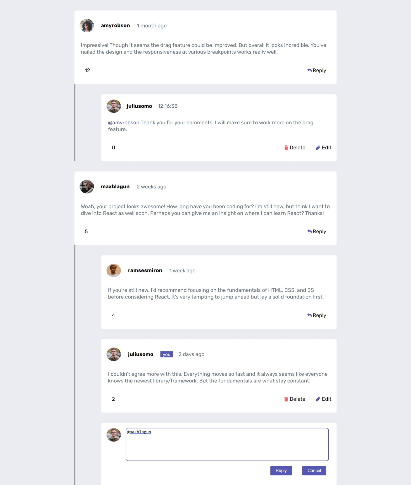
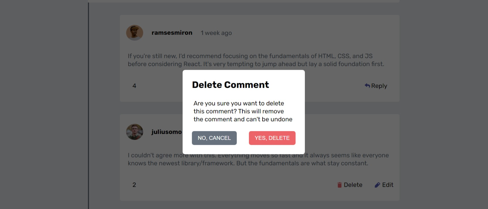

# Frontend Mentor - Interactive comments section solution

This is a solution to the [Interactive comments section challenge on Frontend Mentor](https://www.frontendmentor.io/challenges/interactive-comments-section-iG1RugEG9). Frontend Mentor challenges help you improve your coding skills by building realistic projects. 

## Table of contents

- [Overview](#overview)
  - [The challenge](#the-challenge)
  - [Screenshot](#screenshot)
- [My process](#my-process)
  - [Built with](#built-with)
  - [What I learned](#what-i-learned)
  - [Continued development](#continued-development)
  - [Useful resources](#useful-resources)
- [Author](#author)

## Overview

### The challenge

Users should be able to:

- View the optimal layout for the app depending on their device's screen size
- See hover states for all interactive elements on the page
- Create, Read, Update, and Delete comments and replies

### Screenshot





## My process
This is a project I worked on taking the design challenge and to make it as close as possible using only Google to find the pieces
and solutions whenever I get stuck in a particular area or when I encounter a bug. I went full Vanilla JS for my solution to get pretty
good at it and appreciate the use of the various frameworks/libraries out there to make working with the DOM much easier. And there
were no direct resources of people attempting to work on coding this kind of comment section with pure JS so I had to figure out a lot
of things by myself.
But going with Vanilla JS was a great choice as it made me fine tune my fundamentals of DOM manipulation implementing the options
of CRUD- Create, Read, Update and Delete.  
I also tried to make my code readable and simple by breaking it into small scale functions and even though the nature of Vanilla Js
is not suited to make reusable components, which is the reason why many frameworks are made, I tried to reuse some components that share 
similar characteristics to avoid code-repetition. I have also tried to comment what my functions do, even though I still believe I need
to do more commenting. Overall, I am happy with the journey I came about trying to solve this issue as I learnt a lot of stuff trying to
code up things and make them work altogether.


### Built with

- Semantic HTML5 markup
- CSS custom properties
- Flexbox
- CSS Grid
- Mobile-first workflow

### What I learned

This section is to recap over some of my major learnings while working through this project. Writing these out and providing code samples of areas you want to highlight is a great way to reinforce your own knowledge.

```html
<h1>Some HTML code I'm proud of</h1>
<dialog class="confirm-modal">
    <h2>Delete Comment</h2>
    <p>Are you sure you want to delete this comment? This will remove the comment and can't be undone</p>
    <div class="modal-buttons">
      <button class="cancel-modal-button">NO, CANCEL</button>
      <button class="delete-modal-button">YES, DELETE</button>
    </div>
  </dialog>
```
```css
.proud-of-this-css {
  display: flex;
    cursor: pointer;
    flex-direction: row-reverse;
    align-items: center;
    gap: 3px;
    padding: 1em;
}
```
```js
const proudOfThisFunc = () => {
  //Add an edit and delete if the reply coming from the JSON is from the current user
  const editAndDeleteContainer = document.createElement("div");
  //Conditionally render the container if the user is the currentUser or admin, else set the display to none
  (currentUsername == username) ? editAndDeleteContainer.className = "edit-and-delete-container" : editAndDeleteContainer.className = "invisible";

  replySubmitButton.addEventListener("click", (event) => {
        //Get the closest ancestor where the submit reply button is clicked
        let ancestor = event.target.closest(".text-field-container");
        //Fish out the closest text field or text area to type the comments
        let closestTextField = ancestor.getElementsByClassName("text-field");
        //Get the value or the text inputed in that area
        let typedText = closestTextField[0].value;
        appendReply(event, typedText, username, png, replyTo);
        event.target.closest(".text-field-container").remove();
        var htmlContents = document.documentElement.innerHTML;
        localStorage.setItem('myComments', JSON.stringify(htmlContents ));
    })

    //To get the closest ancestor at which the reply button is clicked 
    let ancestor = event.target.closest(".user-comment-container");
    //Get the replies container of that respective div to attach textarea to
    let closestReplyDiv = ancestor.getElementsByClassName("reply-container")
    closestReplyDiv[0].appendChild(textFieldContainer)
    const newTextField = document.getElementsByClassName("text-field")
    newTextField[newTextField.length - 1].focus();
}
```

### Continued development

I would like to keep working on this project and implement other feature like Upvote/Downvote using a library available to simplify the task.
And add some other features like standalone comment replier for the current user, utilize the local storage to attain a session persist and retain the state whenever refreshed. And migrate the data to an external database so that the replied comments and others are stored there and it supports sharing among different users through cloud.


### Useful resources

- [Resource 1](https://developer.mozilla.org/en-US/docs/Web/API/Element/closest) - This helped me use the property closest to be able to grab the
respective div tags for further editing or deleting of the comment.
- [Resource 2](https://dev.to/ramonak/javascript-how-to-access-the-return-value-of-a-promise-object-1bck) - This is an amazing article which helped me finally understand how the whole asynchronous nature of JavaScript functions work while they fetch data from a JSON file or external API.


## Author

- Website - [Mubarek M.Endrie](http://thatutopiancoder.000webhostapp.com/)


